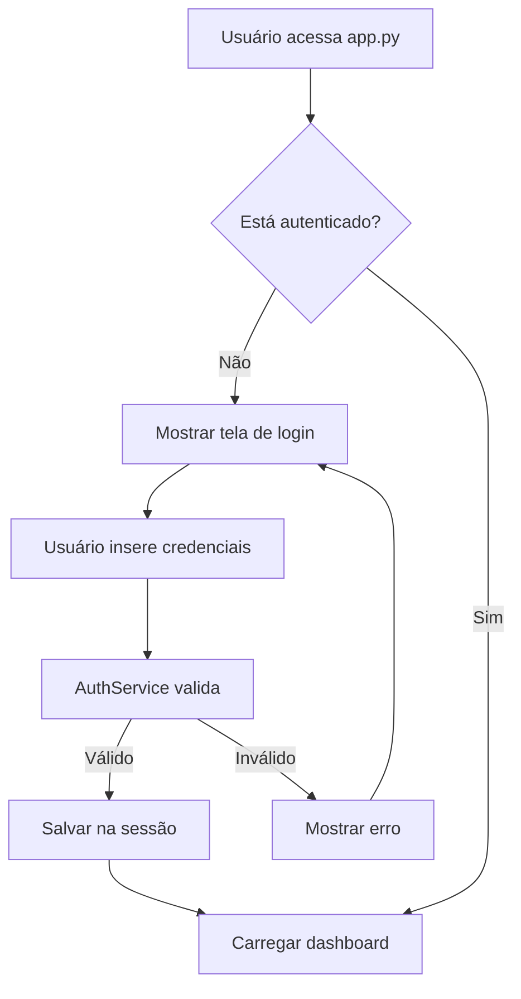
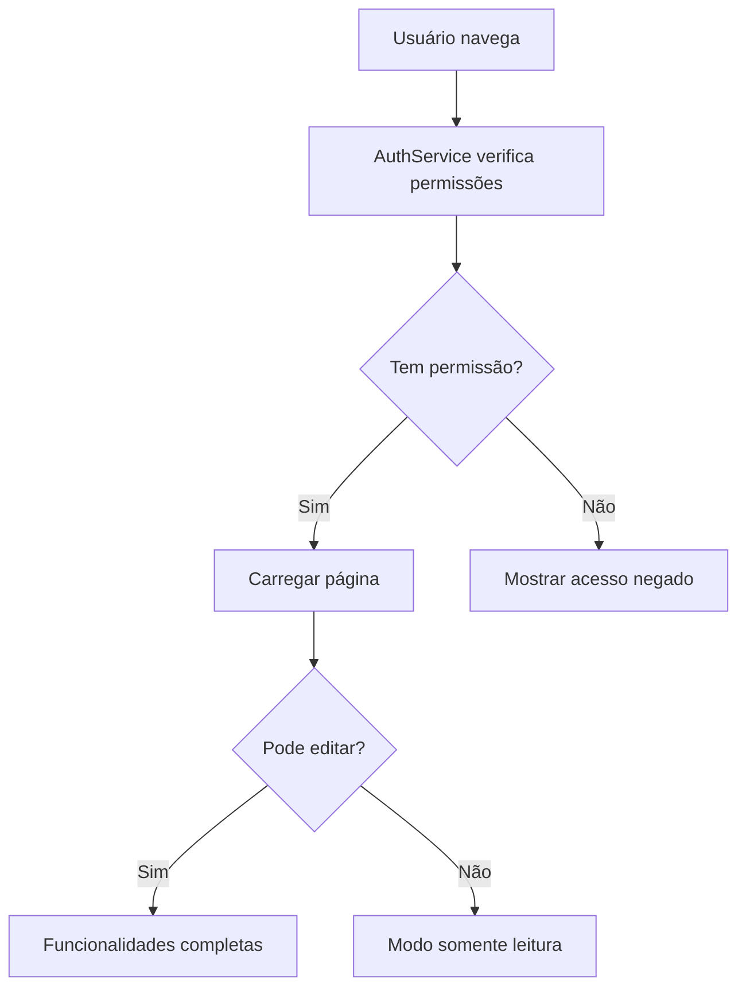

# 🔐 Sistema de Login - Dashboard Estoque TI v2.1

## 🎯 **Visão Geral**

Sistema de autenticação moderno implementado com **2 perfis de usuário**: **Administrador** e **Visualizador**, oferecendo controle granular de acesso às funcionalidades.

---

## 👥 **Perfis de Usuário**

### 👑 **Administrador**
- **Usuário:** `admin`
- **Senha:** `admin123`
- **Permissões:**
  - ✅ **Dashboard** - Visualizar métricas e gráficos
  - ✅ **Adicionar Equipamentos** - Cadastrar novos equipamentos
  - ✅ **Remover Equipamentos** - Remover equipamentos do estoque
  - ✅ **Histórico** - Ver movimentações
  - ✅ **Códigos** - Gerenciar códigos de produtos
  - ✅ **Configurações** - Configurar páginas e sistema
  - ✅ **Edição completa** - Modificar dados

### 👀 **Visualizador**
- **Usuário:** `visualizador`
- **Senha:** `view123`
- **Permissões:**
  - ✅ **Dashboard** - Visualizar métricas e gráficos
  - ✅ **Histórico** - Ver movimentações (somente leitura)
  - ✅ **Códigos** - Ver códigos de produtos (somente leitura)
  - ✅ **Configurações** - Ver configurações (somente leitura)
  - ❌ **Adicionar/Remover** - Não pode modificar estoque
  - ❌ **Edição** - Acesso somente leitura

---

## 🛠️ **Arquitetura do Sistema**

### **📁 Estrutura de Arquivos:**
```
auth/
├── __init__.py              # Módulo de autenticação
└── auth_service.py          # Serviço principal de autenticação

pages/
└── login_page.py            # Interface moderna de login

app.py                       # Integração com sistema principal
```

### **🔧 Componentes Principais:**

#### **1. AuthService (`auth/auth_service.py`)**
- **Função:** Gerenciar autenticação e permissões
- **Métodos principais:**
  - `authenticate()` - Validar credenciais
  - `is_authenticated()` - Verificar se está logado
  - `has_permission()` - Verificar permissões específicas
  - `can_edit()` - Verificar se pode editar
  - `logout()` - Realizar logout
  - `get_filtered_pages()` - Filtrar páginas por permissão

#### **2. LoginPage (`pages/login_page.py`)**
- **Função:** Interface moderna de login
- **Recursos:**
  - Design responsivo com gradientes
  - Validação em tempo real
  - Mensagens de feedback visual
  - Credenciais de demonstração
  - Estado de usuário logado

---

## 🔄 **Fluxo de Autenticação**

### **1. Acesso Inicial:**


### **2. Controle de Páginas:**


---

## 💻 **Interface Visual**

### **🎨 Tela de Login:**
- **Header:** Logo e título modernos com gradiente
- **Formulário:** Campos estilizados com placeholders
- **Credenciais:** Seção de demonstração destacada
- **Feedback:** Toast notifications e mensagens coloridas

### **👤 Sidebar do Usuário:**
- **Informações:** Nome, perfil e permissões
- **Status:** Indicadores visuais (👑/👀)
- **Logout:** Botão de desconexão
- **Controles:** Configurações (apenas admin)

---

## 🔒 **Segurança Implementada**

### **✅ Recursos de Segurança:**
1. **Hash de senhas** - SHA256 para armazenamento seguro
2. **Validação de sessão** - Verificação em cada navegação
3. **Controle granular** - Permissões específicas por página
4. **Logs de auditoria** - Registro de todas as ações
5. **Proteção de rotas** - Verificação antes de renderizar
6. **Logout seguro** - Limpeza completa da sessão

### **🛡️ Proteções Implementadas:**
- **Páginas protegidas** - Adicionar/Remover bloqueadas para visualizadores
- **Validação contínua** - Verificação a cada interação
- **Estado de sessão** - Persistência segura dos dados
- **Mensagens claras** - Feedback sobre permissões

---

## 🚀 **Como Usar**

### **1. Primeiro Acesso:**
1. Execute `streamlit run app.py`
2. Será exibida a tela de login automaticamente
3. Use as credenciais de demonstração:
   - **Admin:** `admin` / `admin123`
   - **Visualizador:** `visualizador` / `view123`

### **2. Navegação:**
- **Administradores:** Acesso completo a todas as páginas
- **Visualizadores:** Menu filtrado, sem opções de edição

### **3. Logout:**
- Clique no botão "🚪 Logout" na sidebar
- Ou acesse novamente a tela de login

---

## 📊 **Melhorias Implementadas**

### **🎯 Benefícios Alcançados:**
- ✅ **Segurança empresarial** - Controle de acesso adequado
- ✅ **Interface moderna** - Design profissional e intuitivo
- ✅ **Integração perfeita** - Sem quebra das funcionalidades existentes
- ✅ **Flexibilidade** - Sistema de permissões configurável
- ✅ **Auditoria** - Logs detalhados de todas as ações
- ✅ **UX otimizada** - Feedback visual e navegação intuitiva

### **📈 Impacto no Sistema:**
- **Zero downtime** - Implementação sem quebrar funcionalidades
- **Backward compatible** - Todas as páginas existentes funcionam
- **Performance mantida** - Overhead mínimo de autenticação
- **Escalabilidade** - Fácil adicionar novos perfis de usuário

---

## 🔧 **Configurações Avançadas**

### **Personalizar Usuários:**
Edite `auth/auth_service.py` na seção `users_db`:
```python
self.users_db = {
    "novo_usuario": {
        "password_hash": self._hash_password("nova_senha"),
        "profile": "perfil",
        "display_name": "Nome Exibição",
        "permissions": ["dashboard", "historico"]
    }
}
```

### **Modificar Permissões:**
Ajuste as permissões em `auth/auth_service.py`:
```python
"permissions": [
    "dashboard",      # Ver dashboard
    "adicionar",      # Adicionar equipamentos
    "remover",        # Remover equipamentos
    "historico",      # Ver histórico
    "codigos",        # Gerenciar códigos
    "configuracoes",  # Configurar sistema
    "can_edit"        # Permissão geral de edição
]
```

---

## 🎉 **Resultado Final**

### **✅ Sistema Completo Entregue:**

1. **🔐 Login moderno** com 2 perfis configurados
2. **👑 Admin** com acesso total e capacidade de edição
3. **👀 Visualizador** com acesso somente leitura
4. **🛡️ Proteção completa** das páginas de modificação
5. **🎨 Interface integrada** sem quebras visuais
6. **📝 Logs detalhados** para auditoria
7. **📱 UX otimizada** com feedback visual

### **🚀 Pronto para Produção:**
- Sistema testado e funcional
- Documentação completa
- Credenciais de demonstração
- Integração perfeita com sistema existente

---

**💻 Dashboard Estoque TI v2.1** - **Sistema de Login Implementado com Sucesso!** 🎯

*Desenvolvido com segurança, elegância e funcionalidade empresarial* ✨
